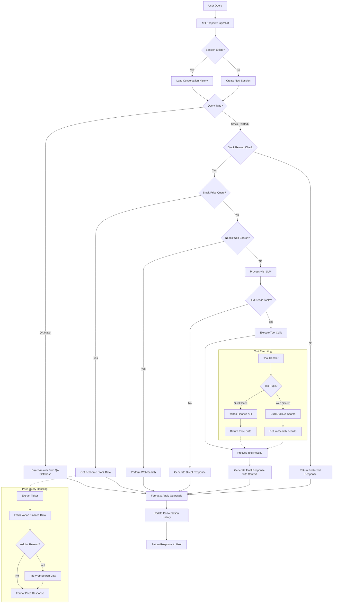
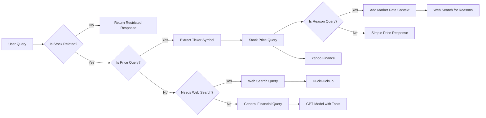
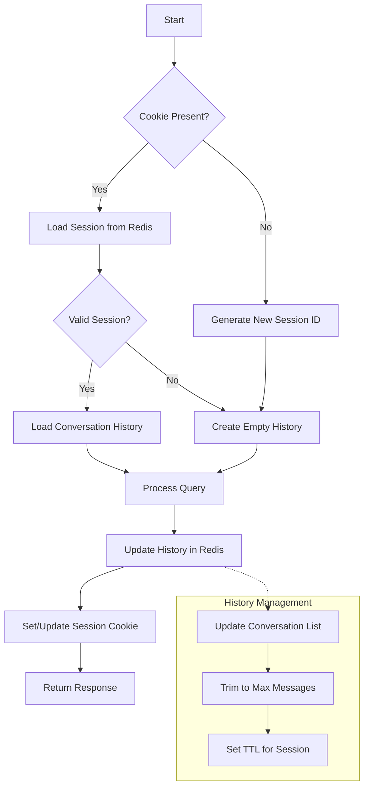
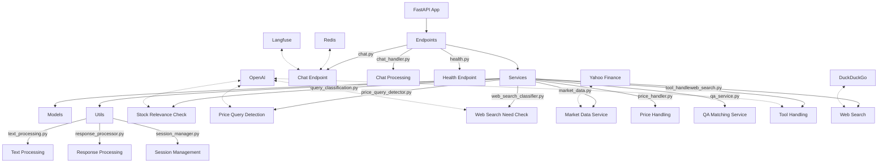
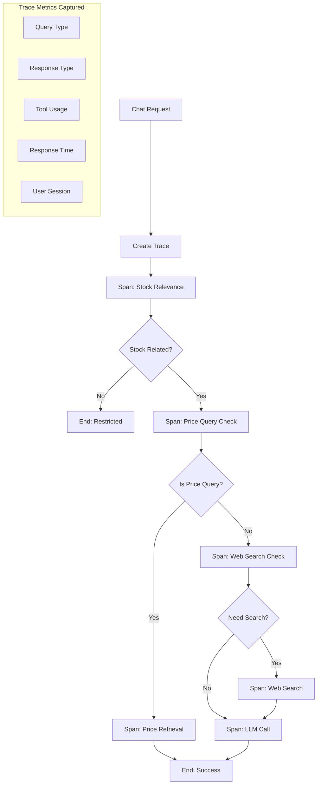

# Naor Chatbot Workflow

Below is a visual representation of the Naor chatbot's processing flow, from receiving a user query to delivering the response.

If you the text is not visible when exporting it as svg try using this: https://mermaid.live/
you need to copy each graph code by itself, from the part flowchart TD to the end of that graph (until you see a new flowchart text)

## Request Processing Flow

## Classification Logic

## Session Management

## Component Interaction

## Langfuse Tracing Integration

