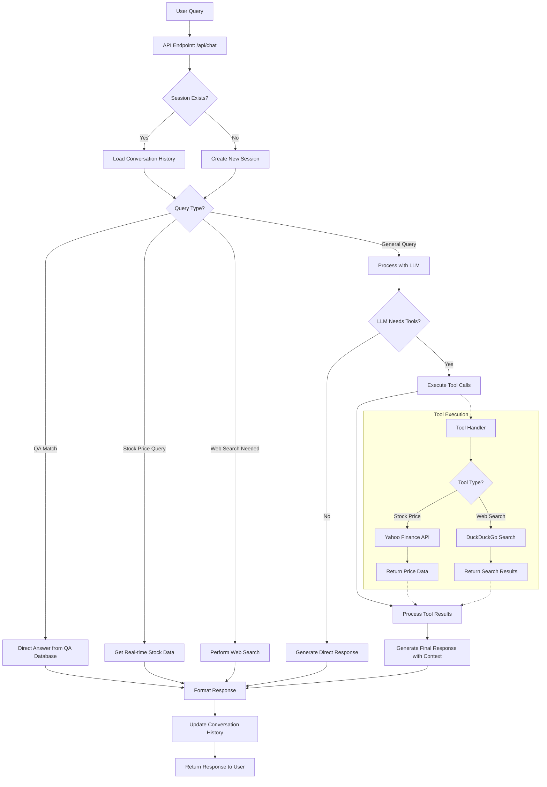
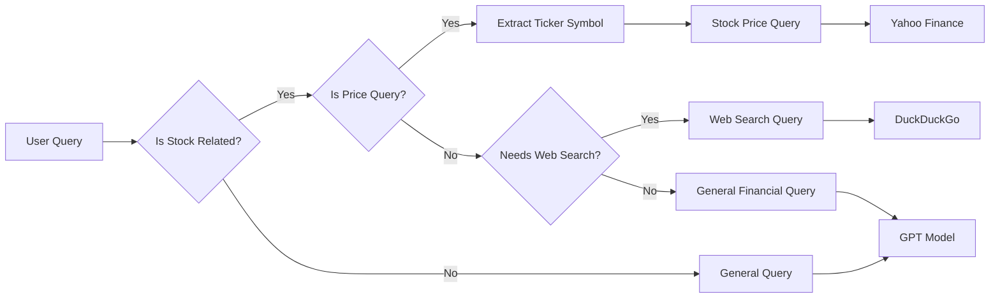
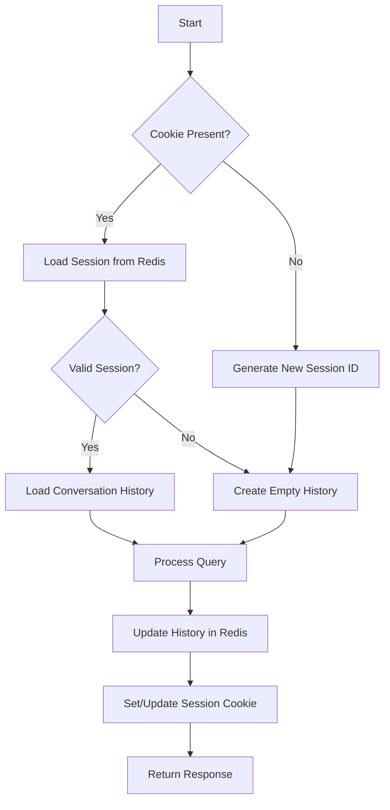
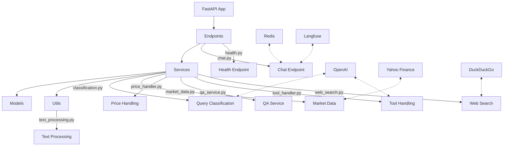

# NextDawnAI Chatbot Workflow

Below is a visual representation of the NextDawnAI chatbot's processing flow, from receiving a user query to delivering the response.

## Request Processing Flow

## Classification Logic

## Session Management

## Component Interaction

